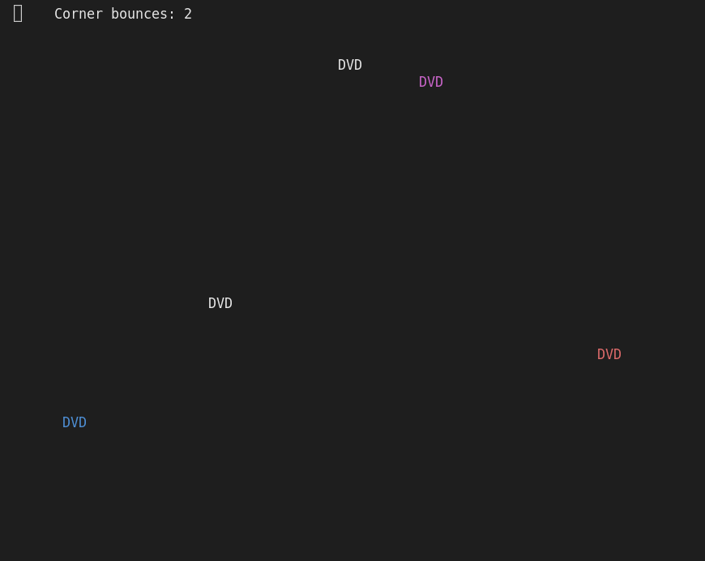

# Bouncing DVD Logo Animation

## Description

This program emulates the classic bouncing DVD logos on the screen. It creates multiple DVD logo objects with randomized positions and directions, then animates their movement within the console window. The logos bounce off the edges and corners of the window, changing direction upon collision.

For an enhanced experience, explore the [Pygame version of this DVD logo animation](https://github.com/joj-macho/Pygame-Playground/tree/main/animate-bouncing-dvd-logo).

## How it Works

- The program starts by importing the necessary modules: `sys`, `random`, `time`, and `bext` (a module for console text and background color manipulation).

- Constants are defined, including:
    - `WIDTH` and `HEIGHT` represent the dimensions of the console window.
    - `NUMBER_OF_LOGOS` determines the number of bouncing DVD logos to display.
    - `PAUSE_AMOUNT` specifies the time delay between each frame.
    - `COLORS` is a list of color options for the logos.
    - `UP_RIGHT`, `UP_LEFT`, `DOWN_RIGHT`, and `DOWN_LEFT` are string constants representing different directions.
    - `DIRECTIONS` is a tuple that contains all the direction constants.
    - `COLOR`, `X_POSITION`, `Y_POSITION`, and `DIRECTION` are used to access specific information in the logo dictionaries.

- The `main` function starts off by clearing the screen using the `bext.clear()`. Then it generates a list of `logos` by calling the `generate_logos` function, which then creates a list of logo dictionaries with random positions and directions. The number of logos generated is based on the `NUMBER_OF_LOGOS` constant. A variable `corner_bounces` is initialized to keep track of the number of times a logo bounces off a corner.

- The program enters an infinite loop where each iteration represents a frame. Within the loop, the program iterates over each logo in the `logos` list and handles the bounce logic.

- The console cursor is moved to the position of the current logo using `bext.goto(logo[X_POSITION], logo[Y_POSITION])`, and three empty spaces are printed using `print(' ', end='')`. This effectively clears the previous logo at its old position. The bounce direction of the logo is stored in `bounce_direction` for later comparison.

- The `handle_bounce` function is called to handle logo bouncing logic. If a logo bounces off a corner, `handle_bounce` returns `True` and the `corner_bounces` counter is incremented. If the current direction of the logo is different from the bounce direction, a new random color is assigned to the logo.

- Depending on the current direction of the logo, its position is updated accordingly by modifying `logo[X_POSITION]` and `logo[Y_POSITION]`. After updating the positions of all logos, the console is moved to the position to display the corner bounces count using `bext.goto(5, 0)`. The color is set to white (`bext.fg('white')`) and the corner bounces count is printed.

- Each logo is then displayed on the console. The console cursor is moved to the logo's position (`bext.goto(logo[X_POSITION], logo[Y_POSITION])`), the color is set to the logo's color (`bext.fg(logo[COLOR])`), and the text "DVD" is printed.

- Finally, the console cursor is moved to the top-left corner using `bext.goto(0, 0)`, the output is flushed (`sys.stdout.flush()`), and the program pauses for a short duration specified by `PAUSE_AMOUNT` using `time.sleep(PAUSE_AMOUNT)`.

- The `generate_logos` function takes the `number_of_logos` argument and returns a list of logo dictionaries. Each logo dictionary contains a random color, random position within the console dimensions, and a random direction.

## Program Input & Output

When you run `bouncing_dvd.py`, the output will look like this:

