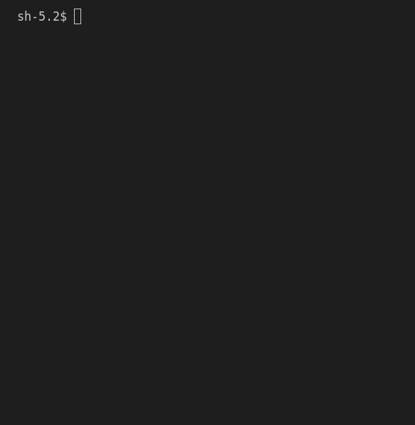

# Bouncing Ball Animation

## Description

The Bouncing Ball Animation program is simple animation of a ball bouncing within a screen.

Check out the [Pygame Playground](https://github.com/joj-macho/Pygame-Playground) repo for more bouncing stuff animations.

## How it Works

- The program animates a ball moving within a defined rectangular area.
- The ball bounce off the walls of the rectangle and change direction upon impact, following basic collision principle.
- The program also tracks the ball's positions, number of bounces, and corner bounces.

## Running the Program

```bash
# Navigate to the project directory
cd bouncing-ball/

# Run the main script
python3 bouncing_ball.py
```

## Program Input & Output

When you run `bouncing_ball.py`, the output will look like this:

