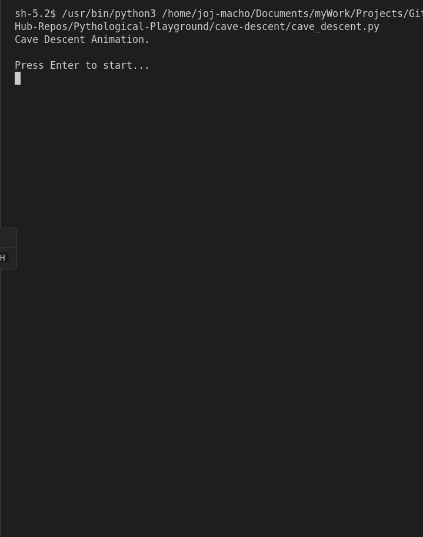

# Cave Descent Animation

## Description

The Cave Descent program creates an animation that simulates descending into a cave tunnel. The tunnel's walls are represented by ASCII characters, with a dynamic gap in the middle that changes position slightly with each line to create the illusion of movement.

## How it Works

- The program runs in a continuous loop, it generates and prints tunnel segments, adjusting the gap position slightly each time.
    - In each iteration, the gap position is adjusted slightly to the left, right, or stays in the same position. 

## Running the Program

```bash
# Navigate to the project directory
cd cave-descent/

# Run the main script
python3 cave_descent.py
```

## Program Input & Output

When you run `cave_descent.py`, the output will look like this:


