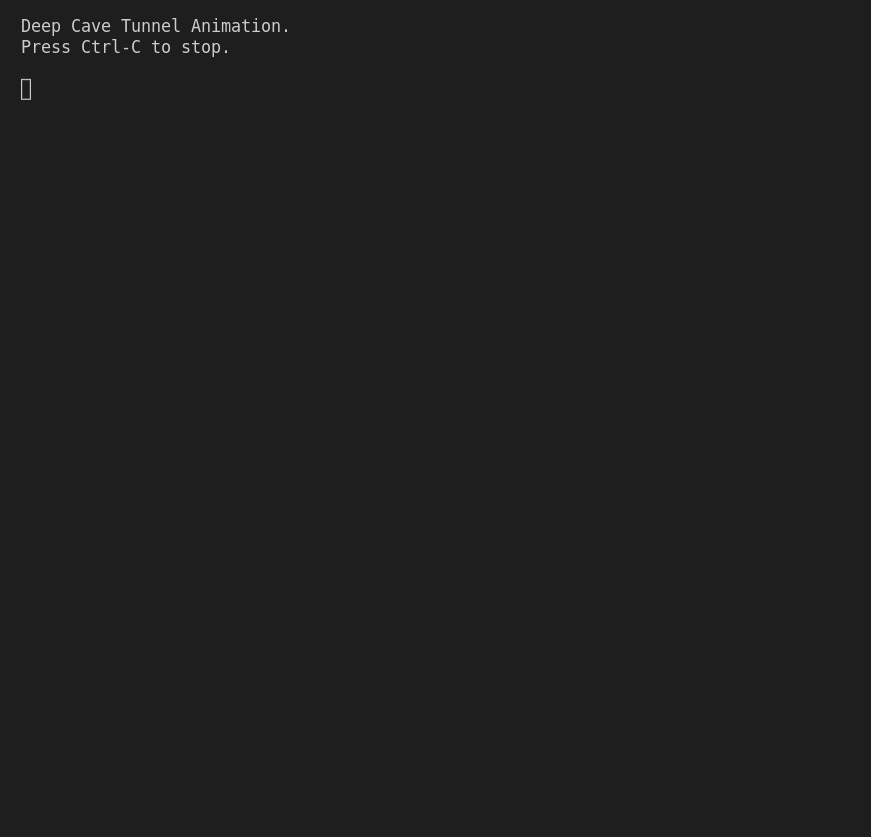

# Deep Cave Tunnel Animation

## Description

The program creates an animated representation of a deep cave tunnel using ASCII characters. It continuously displays segments of the tunnel, with the left and right sides composed of '#' characters and a gap in the middle. The program provides a simple and interactive visual representation of a deep cave tunnel that changes dynamically.

## How it Works

- The program begins by importing the `random`, `sys`, and `time` modules.

- The `main()` function is defined. It starts by displaying a welcome message and a brief pause to give the user time to read it.

- The `left_width` and `gap_width` variables are initialized to control the width of the left side of the tunnel and the gap in the middle, respectively. These values determine the initial appearance of the tunnel.

- The program enters a while loop, which continues indefinitely until interrupted by the user pressing Ctrl-C. Within the loop, the `display_tunnel_segment()` function is called, passing the current `left_width` and `gap_width` as arguments. This function prints a segment of the tunnel using # characters, creating the appearance of the tunnel with the specified dimensions.

- After displaying the tunnel segment, the program waits for a short duration using `time.sleep(0.05)`. This pause creates the illusion of animation by giving the appearance of movement.

-  A random dice roll is generated using `random.randint(1, 6)`. Depending on the value of the dice roll, the `left_width` variable is adjusted to make the tunnel narrower or wider. If the dice roll is 1 and `left_width` is greater than 1, the `left_width` is decreased by 1, making the tunnel narrower on the left side. If the dice roll is 2 and the sum of `left_width` and `gap_width` is less than 69, the `left_width` is increased by 1, making the tunnel wider on the left side.

-  If the user presses Ctrl-C during the animation, the program catches the `KeyboardInterrupt` exception and displays a message indicating that the program is exiting.

## Program Input & Output

When you run `deep_cave.py`, the output will look like this:

