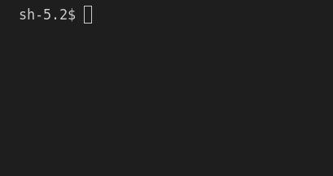

# Digital Clock

## Description

The "Digital Clock" is a basic digital clock that displays the current time using a seven-segment display.

Refer to the [Seven-Segment Display](https://github.com/joj-macho/Pythological-Playground/tree/main/seven-segment-display) program. Also, the [Countdown Timer](https://github.com/joj-macho/Pythological-Playground/tree/main/countdown-timer), similar to the digital clock, uses the seven-sgements display to countdown seconds.

## How it Works

- Continuously fetches the current time from the computer (`time.localtime()`)
- Formats the current time into a human-readable string (`HH:MM:SS`).
- Converts this string into a seven-segment display format.
- Prints the formatted time in the seven-segment display format every second.

## Running the Program

```bash
# Navigate to the project directory
cd digital-clock/

# Run the main script
python3 digital_clock.py
```

## Program Input & Output

When you run the program `digital_clock.py`, the output will look like this;

