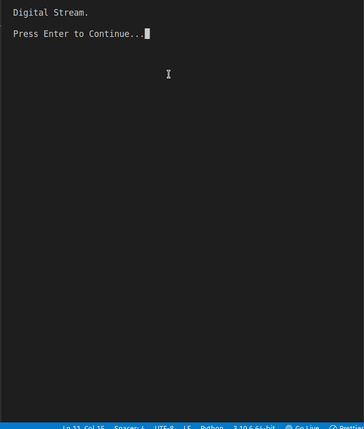

## Description

Digital stream is a simulation of number flowing on the screen, concept from the Matrix Movies. This program simulates a digital stream that consists of randomly generated 0s and 1s. The stream is displayed in the terminal window and is constantly updated.

## How it Works

- The program uses the `shutil` module to get the width of the terminal window and creates a list of column values. The value in each column represents the length of the stream that should be printed in that column.

- The main function begins by printing a welcome message and prompts the user to enter continue. Then enters a loop where at each iteration of the loop, the program checks each column and determines whether a new stream should be generated. If the column has a value of 0, there is no active stream in that column, and the program generates a new stream with a random length, based on the `MIN_STREAM_LENGTH` and `MAX_STREAM_LENGTH` constants.

- If a stream is active, the program prints a random 0 or 1 for each position in the column until the stream ends, at which point spaces are printed to maintain the width of the terminal window. The `DENSITY` constant determines the probability that a new stream will be generated in any given column at each iteration. 

- The program is executed in an infinite loop until the user interrupts it with a KeyboardInterrupt exception, by pressing Ctrl-C.

## Program Output

When you run `digital_stream.py`, the output will look like this;

