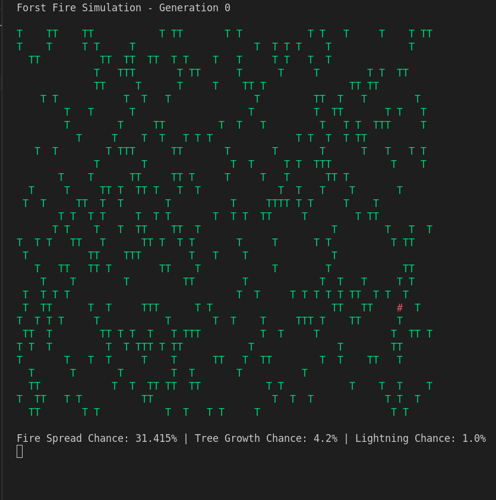

# Forest Fire Simulation

## Description

The Forest Fire Simulation program is a type of cellular automaton used to simulate the spread of fire through a forest. Each cell in the grid represents a part of the forest and can be in one of three states; **Tree (`T`)** (tree is present), **Fire (`#`)** (tree is burning), and **Empty Space (` `)** (no tree is present).

## How it Works

- The program starts by initialize the grid with random states (either EMPTY or TREE)
- Start with a few randomly placed burning trees.
- In each generation:
    - Trees can catch fire randomly based on a probability (`FIRE_CHANCE`).
    - Empty spaces can grow trees based on a probability (`GROWTH_CHANCE`)
    - Fires will spread to adjacent trees with the probability (`FIRE_SPREAD_PROB`)
    - Trees that are burning will turn into empty spaces after burning.

## Running the Program

```bash
# Navigate to the project directory
cd forest-fire-simulator/

# Run the main script
python3 forest_fire_sim.py
```

## Program Input & Output

When you run the program `forest_fire_sim.py`, the output will look like this;


