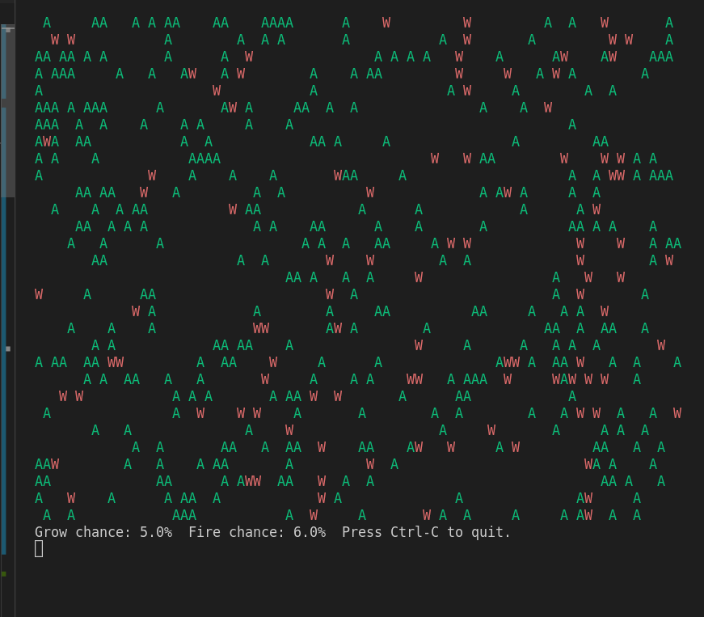

# Forest Fire Simulator

## Description

The Forest Fire Simulation program is a grid-based simulation that models the spread of fire in a forest over time. The program represents the forest as a grid, where each cell can be either a tree, fire, or an empty space. The simulation follows a cellular automaton approach, simulating the growth and burning of trees in the forest.

## How it Works

- <strong>Imports</strong>: The program begins by importing the <code>random</code>, <code>time</code>, and <code>bext</code> modules.
    - The <code>random</code> module is used to generate random numbers, determining the probabilities of tree growth and fire spread in the simulation.
    - The <code>time</code> module introduces delays between simulation steps.
    - The <code>bext</code> module provides functionality to control text and colors in the terminal, allowing the program to display the forest with colored characters.

- <strong>Constants</strong>: Various constants are defined, including the width and height of the forest grid, characters to represent trees and fire, and probabilities for tree growth and fire spread. Additionally, there is a set pause duration between simulation steps.

- The <code>main()</code> function starts by printing a welcome message and then creates the initial forest grid using the <code>create_forest()</code> function. It enters an infinite loop where it repeatedly updates the state of the forest according to a set of rules:
    - For each empty cell, with a probability defined by <code>GROWTH_CHANCE</code>, a tree is grown.
    - For each tree cell, with a probability defined by <code>FIRE_CHANCE</code>, it catches fire.
    - For each fire cell, it spreads to neighboring trees and burns down the original tree.

- In each iteration of the loop, the program goes through each cell of the forest grid and determines the state of the cell in the next iteration based on the current state and predefined probabilities for tree growth and fire spread. After updating all the cells, the new forest grid becomes the current grid for the next iteration.

- The simulation continues until it is interrupted by a keyboard interrupt (Ctrl-C), at which point it displays a message indicating that the simulation has been stopped by the user.

- The <code>create_forest()</code> function initializes the forest grid by randomly placing trees and empty spaces based on a predefined tree density. It returns the initial forest data structure.

- The <code>display_forest()</code> function displays the current state of the forest on the screen, with trees represented by green characters, fire represented by red characters, and empty spaces represented by spaces. It also shows the probabilities for tree growth and lightning-induced fire.

- The <code>simulate_fire()</code> function simulates the forest fire by computing the state of each cell in the next iteration based on the current state and predefined probabilities. It returns the updated forest data structure for the next iteration.

## Program Input & Output

When you run the program `forest_fire_sim.py`, the output will look like this;

