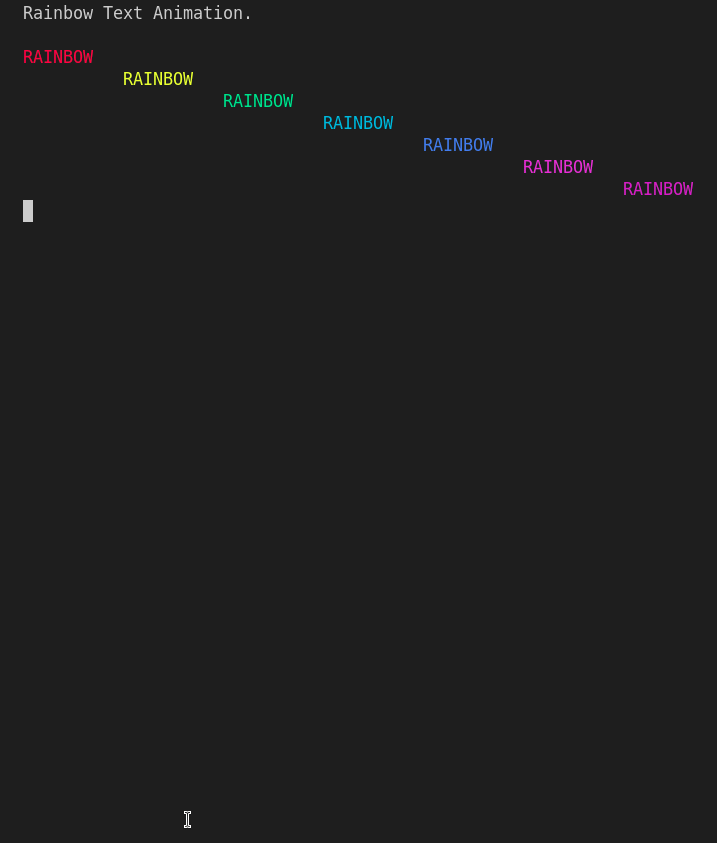

# Rainbow Simulation

## Description

This program creates a rainbow simulation by printing a sequence of colored blocks that move from left to right and then back again.

## How it Works

- The program first imports the `time` and `bext` modules, which are used to introduce delays between iterations of the animation and change the text color of the console (to create a colorful rainbow effect) respectively.

- The program defines a constant `INDENT_LIMIT` which represents the maximum number of spaces for indentation.

- The `main()` function starts by printing a welcome message and waits for the user to press enter to continue. 

- Inside the `main()` function, there are variables indent and `indent_increase` initialized to control the indentation behavior. A try-except block is used to handle the `KeyboardInterrupt` (Ctrl+C) exception and exit the program gracefully. The main animation loop runs indefinitely using a while True loop.

- The program enters a while loop that continues indefinitely. Within the loop, the program prints a sequence of colored blocks using the `bext.fg()` function to set the foreground color for each block. The program uses the following colors in sequence: red, yellow, green, blue, cyan, and purple. The blocks are printed in the form of "##" without any spaces between them.

- After printing the rainbow, the program checks whether the indentation should be increased or decreased. If `indent_increase` is `True`, the indent value is incremented; otherwise, it is decremented. If the indent value reaches the `INDENT_LIMIT`, the `indent_increase` flag is set to False to start decreasing the indentation. If the indent value reaches 0, the `indent_increase` flag is set to True to start increasing the indentation again.

- A small delay of 0.02 seconds is added using `time.sleep(0.02)` to control the animation speed.

- When the user interrupts the program by pressing Ctrl+C, the `KeyboardInterrupt` exception is raised. The program catches the exception, adds a short delay of 0.1 seconds, and prints a message indicating that it is exiting.

## Program Input & Output

When you run the program `rainbow.py`, the output will look like this;

